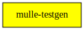

# mulle-testgen

#### 🦟 Torture your code with auto-generated tests

Generates Objective-C tests from introspecting actual methods.

> somewhat neglected
| Release Version                                       | Release Notes
|-------------------------------------------------------|--------------
|  [](//github.com//mulle-testgen/actions)| [RELEASENOTES](RELEASENOTES.md) |


## Usage

Generate Objective-C test files. This script loads an Objective-C static
library. For each non-root Objective-C class that is defined in this
library it emits a test file. By default existing tests are not overwritten.

You should first craft your library. Then generate the test after having
built the library. Then generate the tests and then setup your mulle-test
folder. You can not run **mulle-testgen** inside the `test` folder, as
mulle-test will not have a static library.

So the initial sequence might be:

``` sh
mulle-sde craft  # mulle-testgen should be in `./dependency/bin` now
mulle-sde run mulle-testgen generate
mulle-sde test init
```


Prevent generation of specific tests, by creating a '.' file of the same
name:

``` sh
touch test/10_generated/.foo.m
```

If no tests are selected with options a simple "noleak" test is created.


### You are here



## Add

Use [mulle-sde](//github.com/mulle-sde) to add mulle-testgen to your project:

``` sh
mulle-sde add github:MulleFoundation/mulle-testgen
```

## Install

### Install with mulle-sde

Use [mulle-sde](//github.com/mulle-sde) to build and install mulle-testgen:

``` sh
mulle-sde install --prefix /usr/local \
   https://github.com/MulleFoundation/mulle-testgen/archive/latest.tar.gz
```

### Manual Installation


Download the latest [tar](https://github.com/MulleFoundation/mulle-testgen/archive/refs/tags/latest.tar.gz) or [zip](https://github.com/MulleFoundation/mulle-testgen/archive/refs/tags/latest.zip) archive and unpack it.

Install **mulle-testgen** into `/usr/local` with [cmake](https://cmake.org):

``` sh
cmake -B build \
      -DCMAKE_INSTALL_PREFIX=/usr/local \
      -DCMAKE_PREFIX_PATH=/usr/local \
      -DCMAKE_BUILD_TYPE=Release &&
cmake --build build --config Release &&
cmake --install build --config Release
```

## Author

[Nat!](https://mulle-kybernetik.com/weblog) for Mulle kybernetiK


